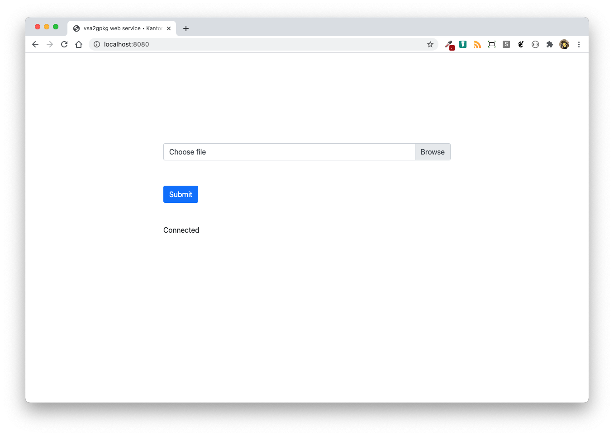
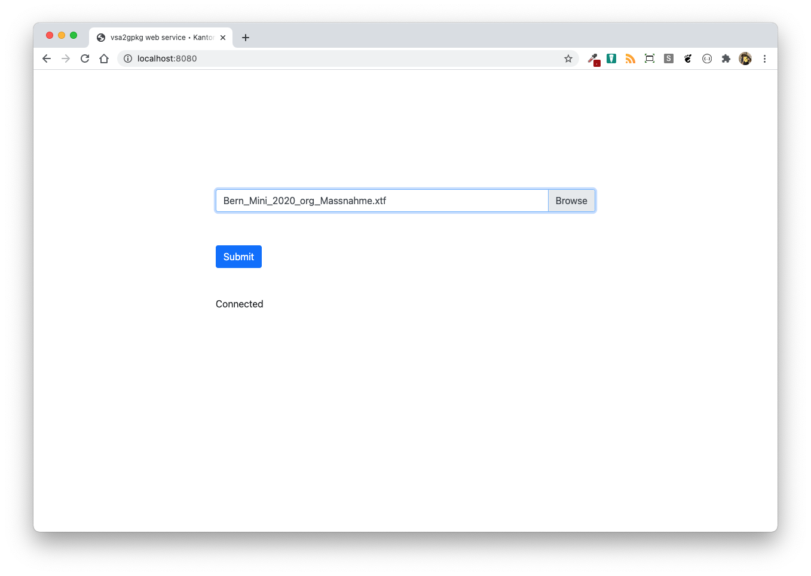
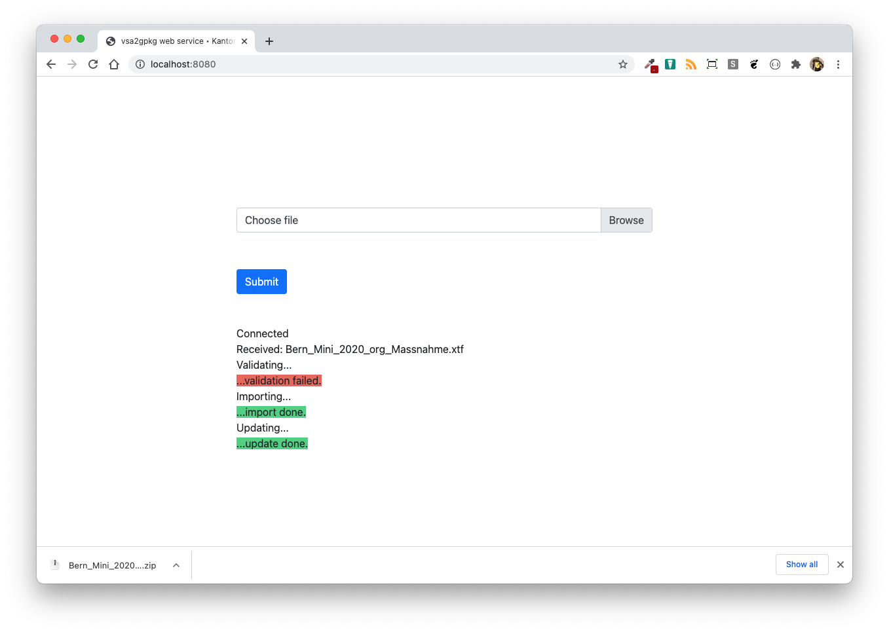
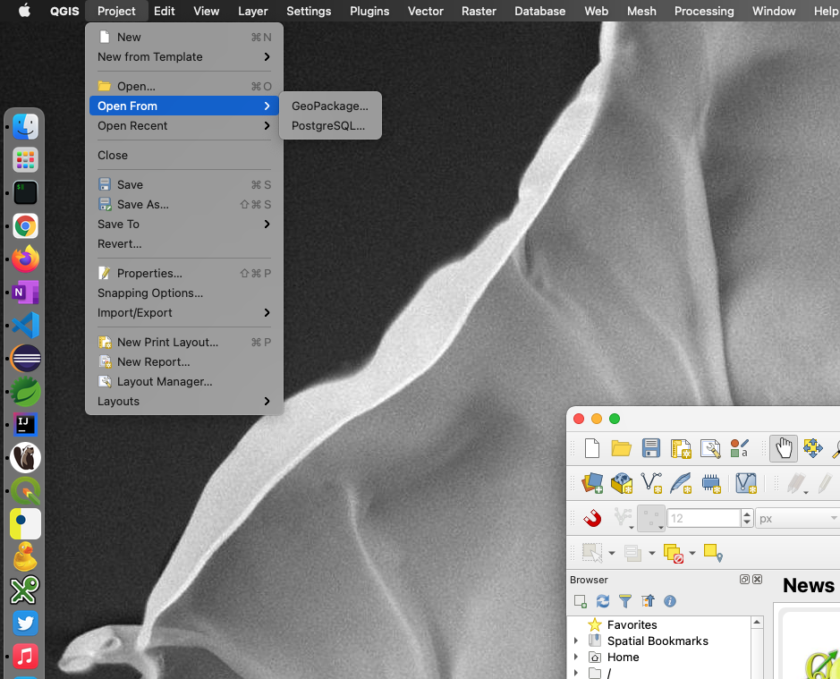
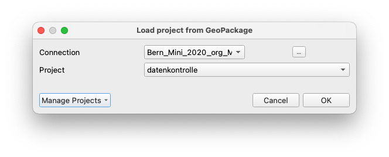
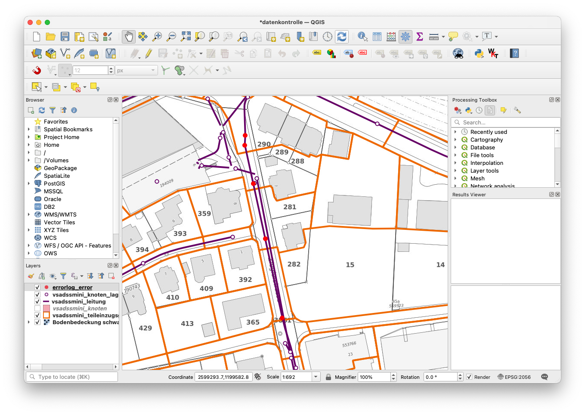
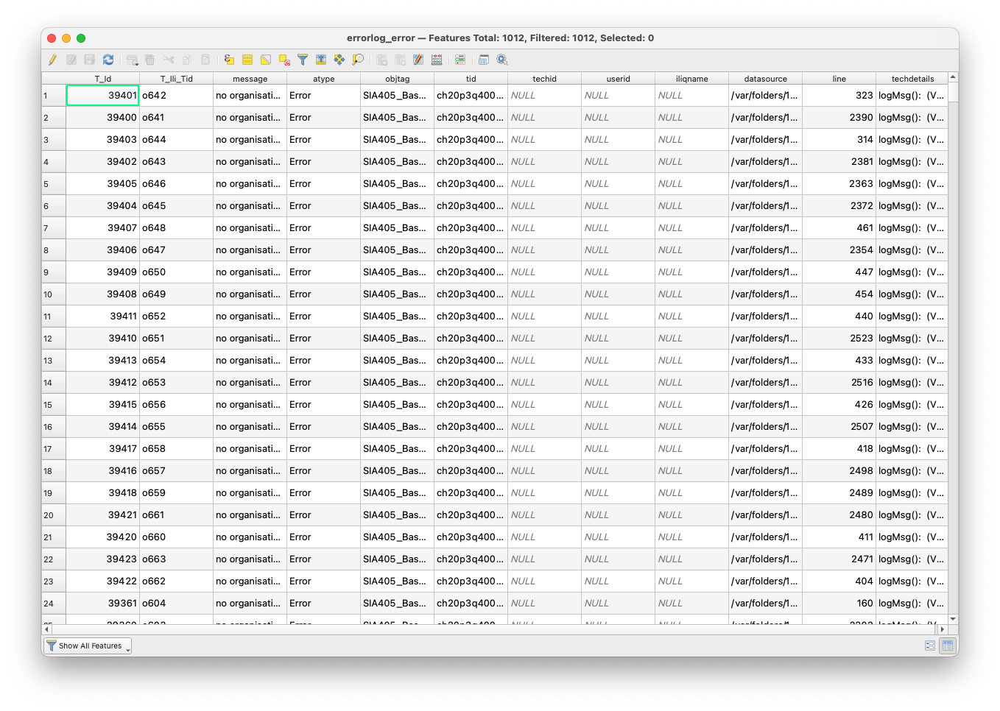

# Benutzerhandbuch

## Bedienung des Webservices

Der *vsa2gpkg-web-service* stellt eine einfache 

Der *vsa2gpkg web service* stellt eine einfache Art dar INTERLIS-Daten im Modell VSA-DSS-mini-2020 auf Modellkonformität zu prüfen. Die zu prüfenden INTERLIS-Daten werden mittels Webformular auf einen Server hochgeladen, wo sie anschliessend automatisch geprüft werden. Das Prüfresultat besteht aus zwei Logdateien und einer GeoPackage-Datei zum Visualisieren der Daten und der allenfalls gefundenen Fehler. Es als Zip-Datei zurück an den Client geschickt.

Beim Aufruf des *vsa2gpkg web services* erscheint folgendes Webformular:

Im Browserfenster unter dem "Submit"-Knopf muss zwingend "Connected" stehen. 

Die zu prüfende Datei kann durch Knopfdruck auf "Browse" ausgewählt werden. Die Datei darf *nicht* gezippt sein und höchstens 100 Megabyte gross sein. Im Feld "Choose file" erscheint neu der Name der ausgewählten Datei.

Die Validierung kann durch Knopfdruck auf "Submit" gestartet werden. Der Knopf wird ausgegraut und es können keine weiteren Aktionen auf der Webseite vorgenommen werden. Im Browserfenster erscheinen die meldungen "Received: <Dateiname>" und "Validating...". Es folgen weitere Rückmeldungen des Servers zum Client (abhängig vom Prozessfortschritt). 

Das Prüfresultat wird als gezippte Datei an den Browser zurückgeschickt:

Die entpackte Zipdatei enthält im Regelfall drei Dateien. Zwei Logfiles (normaler Text-Datei und INTERLIS-Datei) und eine GeoPackage-Datei. In der GeoPackage-Datei wurden die zu prüfenden Daten importiert und auch die allenfalls gefundenen Fehler. Es kann bei gewissen Fehlern vorkommen, dass die Daten nicht importiert werden können, z.B. falls die TID doppelt im Transferfile vorkommt. Ansonsten ist GeoPackage (SQlite) relativ tolerant und es wurden möglichst alle Datenbank-Constraint-Optionen der Importsoftware (*ili2gpkg*) ausgeschaltet. 

Die GeoPackage-Datei beinhaltet ebenfalls ein vorbereitete QGIS-Projektdatei, damit die Daten und Fehler einfach visuell dargestellt werden können. Es kann unter "Projects - Open From - GeoPackage" geöffnet werden:

Es muss die vorgängig entzippte GeoPackage-Datei gewählt werden. Es existiert nur eine QGS-Projektdatei ("datenkontrolle"):

Die Daten- und die Fehler-Tabellen werden geladen:

Der Layer "errorlog_error" enthält alle gefundenen Fehler. 

Achtung: Nicht alle gefundenen Fehler haben eine Koordinate. Diese werden in der Karte *nicht* dargestellt. 

